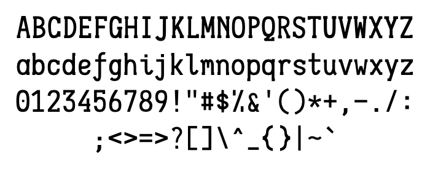
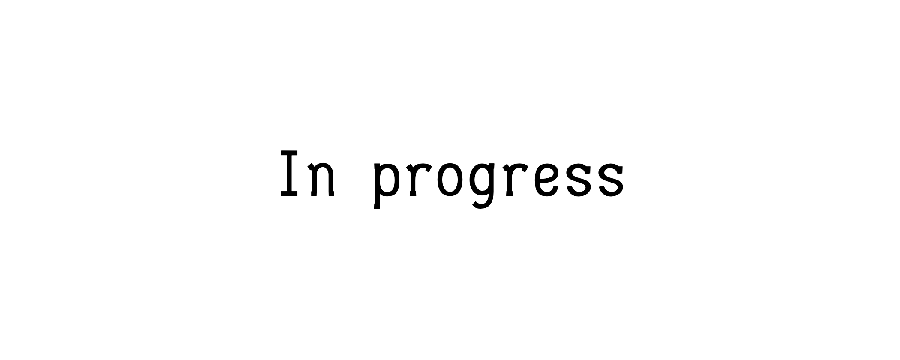
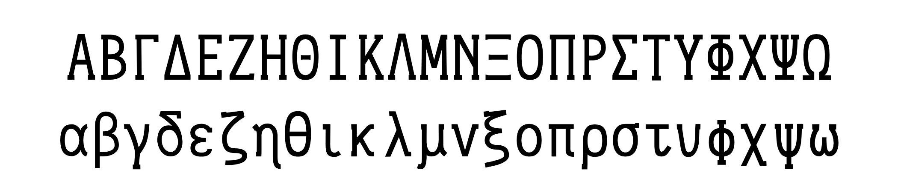

Shinkai Mono
============

 &nbsp; 

A monospaced font, currently under development.

Variants
-------

### Shinkai Mono

<table>
  <tr>
    <td colspan="2"><strong>ASCII</strong></td>
  </tr>
  <tr>
    <td>Printable ASCII Characters</td>
    <td>Ligatures for Readability</td>
  </tr>
  <tr>
    <td></td>
    <td></td>
  </tr>
  <tr>
    <td colspan="2"><strong>Greek</strong></td>
  </tr>
  <tr>
    <td>Greek Alphabet</td>
  </tr>
  <tr>
    <td></td>
  </tr>
</table>

### Shinkai Mono for Lean

<table>
  <tr>
    <td>Ligatures for Code</td>
    <td>Math Symbols</td>
  </tr>
  <tr>
    <td></td>
    <td></td>
  </tr>
</table>

License
-------

SIL Open Font License v1.1
